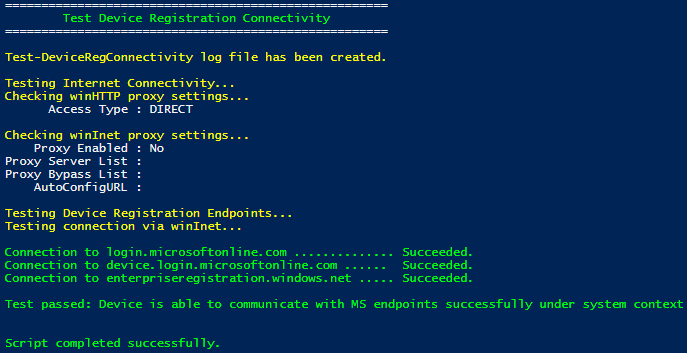
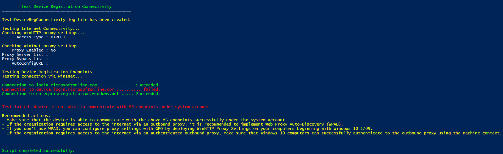
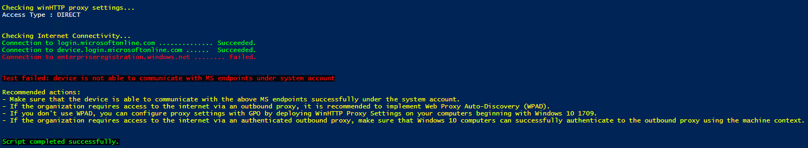

# Test Device Registration Connectivity
Test-DeviceRegConnectivity PowerShell script helps to test the Internet connectivity to the following Microsoft resources under the system context to validate the connection status between the device that needs to be connected to Azure AD as hybrid Azure AD joined device and Microsoft resources that are used during device registration process. It also, checks for SSL/TLS handshake and report as failure if any.

  - https://login.microsoftonline.com
  - https://device.login.microsoftonline.com
  - https://enterpriseregistration.windows.net
 
## Why is this script helpful

  - You don’t need to rely on PS Exec tool to test the Internet connectivity under the system context, you need just to run it as administrator.
  - You don’t need to collect network trace during device registration and analyze it to verify the Internet connectivity.
  - You don’t need to check the Internet gateway (web proxy or firewall) to verify the Internet connectivity.

> [!NOTE]
> Using this script, Internet connectivity troubleshooting time will be reduced, and you need just to run it as administrator.

## How to run the script

Download and run the `Test-DeviceRegConnectivity.ps1` script from this GitHub repo. 

## User experience

- When the test passes successfully

 

- When the test fails

 

 

> [!NOTE]
> You can use [DSRegTool](https://docs.microsoft.com/en-us/samples/azure-samples/dsregtool/dsregtool/) which is a comprehensive tool that performs more than 50 different tests that help you to identify and fix the most common device registration issues for all join types.
